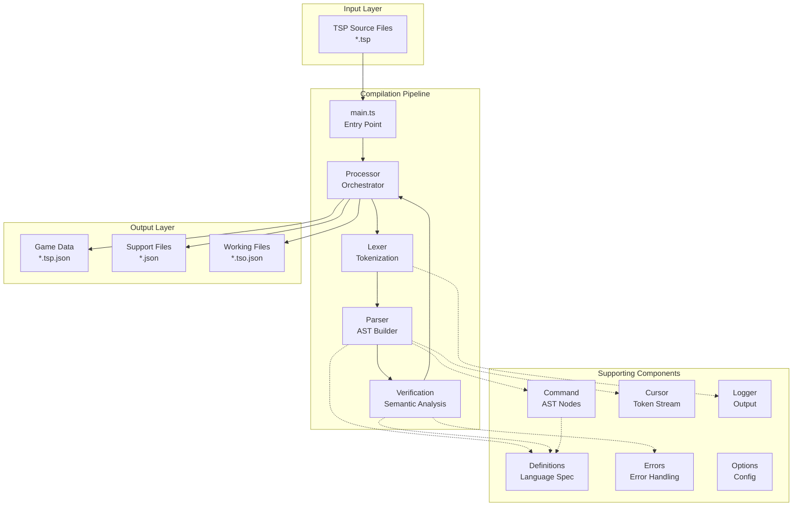
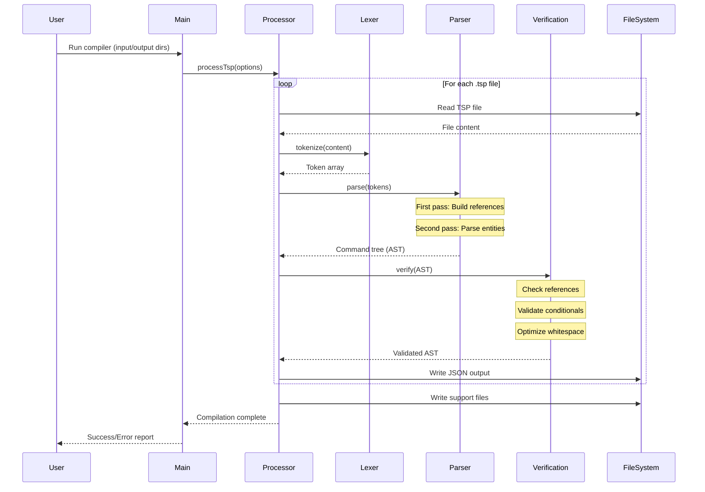
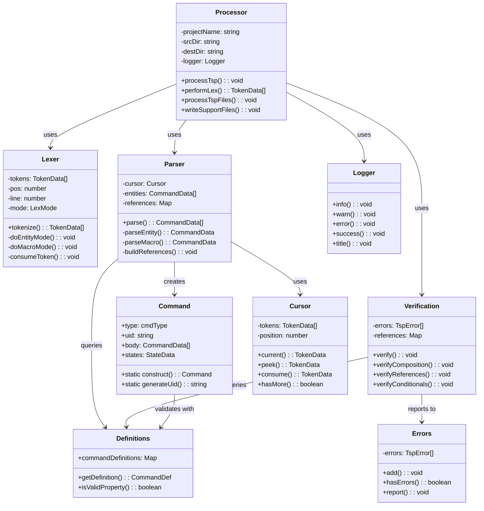
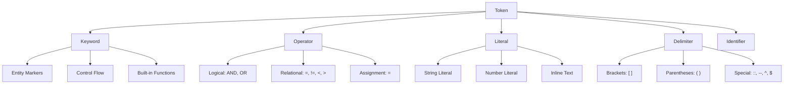
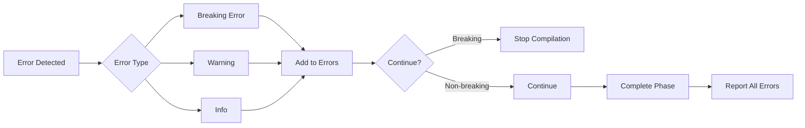

# TaleSpinner Compiler - Technical Documentation

This document provides detailed technical information about the TaleSpinner (TSP) compiler architecture, including system diagrams, class structures, and implementation details.

## Table of Contents

1. [System Architecture Overview](#system-architecture-overview)
2. [Compilation Pipeline Flow](#compilation-pipeline-flow)
3. [Class Hierarchy and Dependencies](#class-hierarchy-and-dependencies)
4. [Detailed Class Documentation](#detailed-class-documentation)
5. [Data Structures](#data-structures)
6. [Token Types and Grammar](#token-types-and-grammar)
7. [Error Handling System](#error-handling-system)
8. [Output File Formats](#output-file-formats)

## System Architecture Overview



## Compilation Pipeline Flow



## Class Hierarchy and Dependencies



## Detailed Class Documentation

### Lexer Class

The Lexer performs context-sensitive tokenization of TSP source files.

#### Key Properties
- `tokens: TokenData[]` - Output token array
- `pos: number` - Current position in input
- `line: number` - Current line number
- `mode: LexMode` - Current lexing context

#### Lexing Modes
```typescript
enum LexMode {
    Entity,      // :: EntityName --type
    Macro,       // [macro content]
    Hotlink,     // [[link text]]
    Settings,    // [settings] block
    Scenery,     // [scenery] block
    Inline       // `inline text`
}
```

#### Token Recognition Patterns
- **Comments**: `//` to end of line
- **Entities**: `:: Name --type (attributes)`
- **Macros**: `[command options]`
- **Inline Text**: `` `text` ``
- **Links**: `[[text `direction`]]`
- **References**: `^propName^`, `$variable$`

### Parser Class

The Parser builds an Abstract Syntax Tree using recursive descent parsing.

#### Two-Pass Processing
1. **First Pass**: Build reference map of all entities and variables
2. **Second Pass**: Parse full command structure with resolved references

#### Key Methods
```typescript
parse(tokens: TokenData[]): CommandData[] {
    // First pass: collect all entity names
    this.buildReferences();
    
    // Second pass: full parsing
    while (this.cursor.hasMore()) {
        this.entities.push(this.parseEntity());
    }
    
    return this.entities;
}
```

#### Parsing Strategies
- **Entity Parsing**: Handles entity declarations and their bodies
- **Macro Parsing**: Processes both simple and structured macros
- **Expression Parsing**: Handles conditional logic with precedence

### Command Class

Represents all elements in the game as a unified command structure.

#### Command Types (cmdType enum)
```typescript
enum cmdType {
    // Entities
    entity = "entity",
    location = "location",
    person = "person",
    
    // Macros
    macro = "macro",
    structuredMacro = "structuredMacro",
    
    // Statements
    statement = "statement",
    assignment = "assignment",
    conditional = "conditional",
    
    // Text
    text = "text",
    inline = "inline",
    
    // References
    reference = "reference",
    function = "function"
}
```

#### State Management
```typescript
interface StateData {
    visited?: boolean
    carried?: boolean
    worn?: boolean
    locked?: boolean
    opened?: boolean
    [key: string]: any
}
```

### Verification Class

Performs semantic analysis and validation of the AST.

#### Validation Rules
1. **Entity References**: All referenced entities must exist
2. **Variable Scope**: Variables must be declared before use
3. **Conditional Logic**: Boolean expressions must be well-formed
4. **Command Structure**: Commands must match their definitions
5. **State Consistency**: Entity states must be valid

#### Error Classification
- **Breaking Errors**: Prevent compilation (missing entities, syntax errors)
- **Warnings**: Non-breaking issues (unused variables, style violations)
- **Info**: Optimization suggestions

### Processor Class

Orchestrates the entire compilation pipeline.

#### Compilation Phases


#### Output Generation
1. **Main Game File**: `[GameName].tsp.json`
2. **Working Files**: Individual `.tso.json` and `.tsp.json` per source
3. **Support Files**:
   - `CommandDefinitionKeys.json`
   - `CommandDefinitionRegex.txt`
   - `OptionDefinitionKeys.json`

## Data Structures

### TokenData Structure
```typescript
interface TokenData {
    type: TokenType         // Token classification
    value: string          // Token text
    pos: number           // Character position
    line: number         // Line number
    unlowered?: string  // Original case (for strings)
}
```

### CommandData Structure
```typescript
interface CommandData {
    // Core properties
    type: cmdType
    uid: string
    
    // Content
    body?: CommandData[]    // Nested commands
    text?: string          // Text content
    
    // Entity properties
    name?: string
    location?: string
    states?: StateData
    
    // Control flow
    cond?: LogicalExpression[]
    
    // References
    ref?: string           // Entity reference
    var?: string          // Variable reference
    
    // Metadata
    line?: number
    pos?: number
}
```

### LogicalExpression Structure
```typescript
interface LogicalExpression {
    lval: string              // Left operand
    op: RelationalOperator   // =, !=, <, >, <=, >=
    rval: string            // Right operand
    lop?: LogicalOperator  // AND, OR
}
```

## Token Types and Grammar

### Core Grammar Rules (Simplified)
```
Program        ::= Entity*
Entity         ::= '::' Name '--' Type Attributes? Body
Body           ::= (Macro | Statement | Text)*
Macro          ::= '[' Command Options? ']'
Statement      ::= Assignment | Conditional | FunctionCall
Assignment     ::= Variable '=' Expression
Conditional    ::= 'if' '(' LogicalExpr ')' Body ('else' Body)?
FunctionCall   ::= Function '(' Arguments? ')'
```

### Token Type Hierarchy


## Error Handling System

### Error Flow


### Error Message Format
```
[ERROR] filename.tsp:12:5 - Entity 'treasure' not defined
  12 | [give treasure to player]
       ^^^^^^^^^^^^^^^^^^^^^^^
```

## Output File Formats

### Main Game File (*.tsp.json)
```json
{
  "projectName": "MyGame",
  "version": "1.0.0",
  "entities": [
    {
      "type": "location",
      "uid": "loc_001",
      "name": "start",
      "body": [/* commands */]
    }
  ],
  "metadata": {
    "compiled": "2024-01-01T00:00:00Z",
    "compiler": "tsp-compiler v1.0.1"
  }
}
```

### Working File (*.tso.json)
```json
{
  "tokens": [
    {"type": "ENTITY_MARKER", "value": "::", "line": 1, "pos": 0},
    {"type": "IDENTIFIER", "value": "start", "line": 1, "pos": 3}
  ],
  "source": "filename.tsp",
  "lexTime": 0.123
}
```

### Support Files

#### CommandDefinitionKeys.json
Sorted array of all valid command names for runtime validation.

#### CommandDefinitionRegex.txt
Regular expressions for pattern matching commands at runtime.

#### OptionDefinitionKeys.json
Valid option tags for structured commands (if/else, hotlinks, etc.).

## Performance Considerations

1. **Memory Usage**: Token arrays and AST are kept in memory
2. **Two-Pass Parsing**: Trades memory for better error detection
3. **Whitespace Optimization**: Reduces output size significantly
4. **Parallel Processing**: Files are processed sequentially (optimization opportunity)

## Extension Points

1. **New Command Types**: Add to `Definitions.ts` and `cmdType` enum
2. **Custom Functions**: Extend `globalFuncKeys` in `Command.ts`
3. **Output Formats**: Modify `Processor.writeSupportFiles()`
4. **Language Features**: Extend lexer modes and parser methods

## Known Limitations

1. **Error Recovery**: Limited ability to recover from syntax errors
2. **Debugging**: No source maps for runtime debugging
3. **Optimization**: No dead code elimination or optimization passes
4. **Type System**: No type checking for variables or expressions
5. **Module System**: No import/include mechanism for code reuse